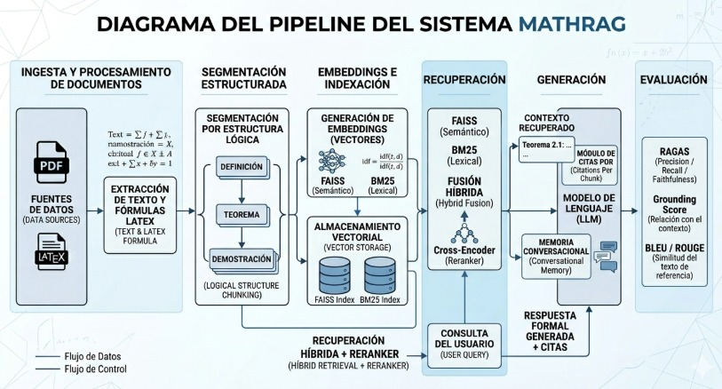
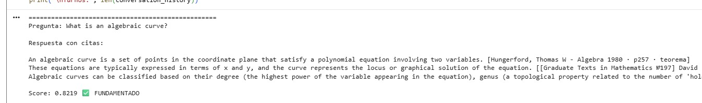
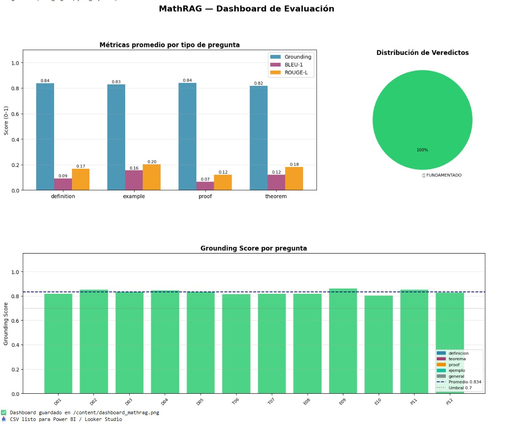
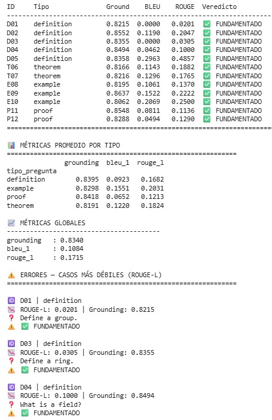

# MathRAG: Mathematical Retrieval-Augmented Generation System

## Descripción

MathRAG es un sistema basado en arquitectura Retrieval-Augmented Generation (RAG) orientado a la recuperación y generación contextual de conocimiento matemático utilizando modelos de lenguaje (LLMs).

El proyecto integra técnicas de recuperación híbrida mediante FAISS y BM25 para consultar documentos matemáticos y generar respuestas contextualizadas utilizando embeddings y modelos de lenguaje.

---

## Objetivos del proyecto

- Implementar un sistema RAG especializado en contenido matemático.
- Explorar recuperación híbrida semántica y lexical.
- Integrar embeddings y modelos LLM para consulta contextual.
- Evaluar estrategias de recuperación y reranking.

---

## Tecnologías utilizadas

- Python
- HuggingFace Transformers
- FAISS
- BM25
- Sentence Transformers
- Cross-Encoder
- LangChain
- PyTorch

---

## Arquitectura del sistema

El pipeline de MathRAG incluye:

1. Carga y procesamiento de documentos matemáticos.
2. Limpieza y segmentación del contenido.
3. Generación de embeddings semánticos.
4. Recuperación híbrida:
   - FAISS (semántica)
   - BM25 (lexical)
5. Reranking contextual con Cross-Encoder.
6. Generación de respuestas utilizando LLMs.

---

## Arquitectura general



---

## Pipeline de consulta

El sistema realiza recuperación contextual mediante búsqueda híbrida y generación aumentada.



---

## Dashboard y monitoreo

Visualización del comportamiento del sistema y métricas de recuperación.



---

## Resultados y benchmark

Evaluación comparativa del desempeño del sistema RAG.



---

## Características principales

- Recuperación híbrida semántica + lexical.
- Procesamiento especializado de contenido matemático.
- Integración de embeddings y LLMs.
- Pipeline modular y extensible.
- Reranking contextual con Cross-Encoder.

---

## Aplicaciones potenciales

- Asistentes académicos matemáticos.
- Consulta de documentos científicos.
- Sistemas de tutoría inteligente.
- Recuperación de conocimiento técnico y científico.

---

## Estructura del proyecto

```bash
math-rag-system/
│
├── ProyectoInovador_notebook.ipynb
├── README.md
├── requirements.txt
└── imagenes/
    ├── Arquitectura.jpeg
    ├── ConsultaPipeline.jpeg
    ├── Dashboard.jpeg
    └── ResultadosBenchmark.jpeg
```

---

## Instalación

Clonar repositorio:

```bash
git clone https://github.com/Jeison817/math-rag-system.git
```

Instalar dependencias:

```bash
pip install -r requirements.txt
```

---

## Objetivos técnicos explorados

- Sistemas RAG especializados.
- Recuperación semántica mediante embeddings.
- Búsqueda híbrida FAISS + BM25.
- Reranking contextual.
- Integración de LLMs para generación de respuestas.

---

## Autor

Jeison Josimar Contreras Meza

- GitHub: github.com/Jeison817
- LinkedIn: linkedin.com/in/jeison-josimar-contreras-meza-b45938357
